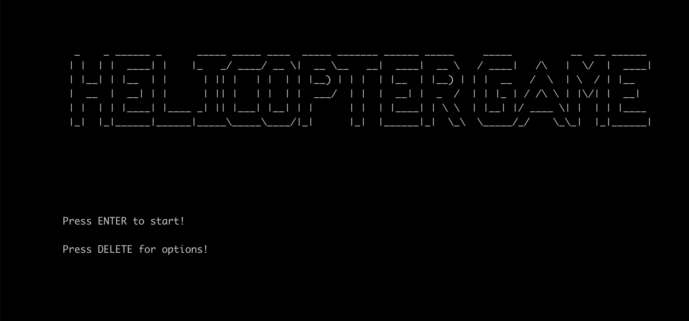
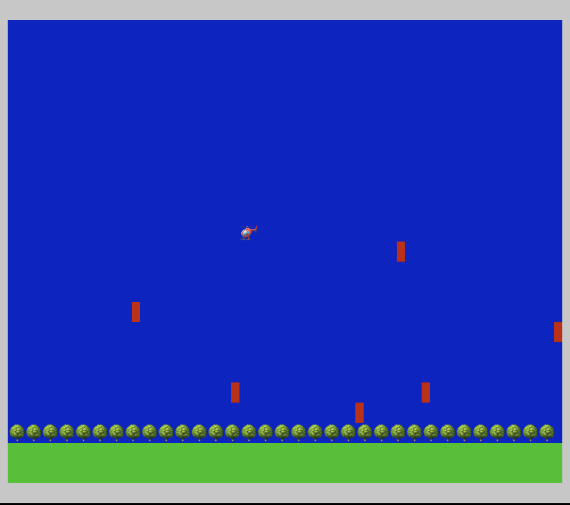

## helicopter-go

Inspired by tristangoossens implementation of [Snake in Go](https://github.com/tristangoossens/snake-go/)

### Gameplay screenshots

Title Screen:

<p>
    
</p>

Game Play:
<p>
    
</p>


### Clone and play

Clone:

```shell
git clone git@github.com:vinayman/helicopter-go.git
```

Play:

```bash
go run main.go
```